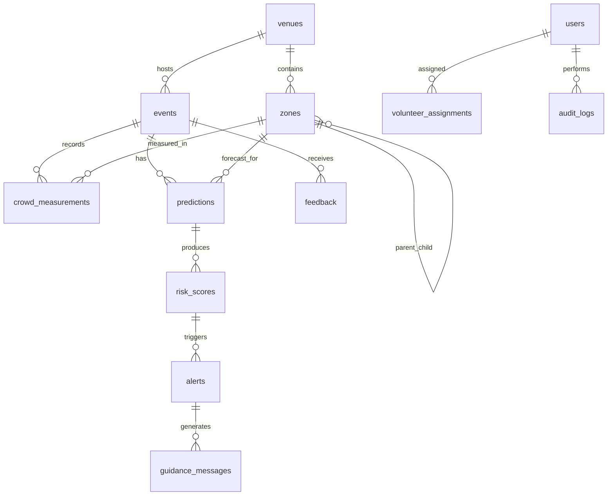

# Database Design

Database: Supabase Postgres

## Core Tables

### users

- id: UUID primary key.
- email: unique.
- full_name.
- role: fan, volunteer, operator, organizer, admin.
- preferred_language.
- created_at.
- updated_at.

### events

- id: UUID primary key.
- name.
- venue_id: foreign key to venues.id.
- starts_at.
- ends_at.
- status.
- created_at.

### venues

- id: UUID primary key.
- name.
- city.
- country.
- timezone.
- metadata_json.

### zones

- id: UUID primary key.
- venue_id: foreign key to venues.id.
- name.
- zone_type: gate, concourse, stand, transit, restroom, concession, exit.
- capacity.
- parent_zone_id: nullable foreign key to zones.id.
- geometry_json.
- created_at.

### crowd_measurements

- id: UUID primary key.
- event_id: foreign key to events.id.
- zone_id: foreign key to zones.id.
- measured_at.
- density_count.
- flow_rate_per_minute.
- queue_length.
- source_type.
- confidence.
- raw_payload_json.

### predictions

- id: UUID primary key.
- event_id.
- zone_id.
- generated_at.
- horizon_minutes.
- predicted_density_count.
- predicted_flow_rate_per_minute.
- predicted_queue_length.
- confidence.
- model_version.

### risk_scores

- id: UUID primary key.
- event_id.
- zone_id.
- prediction_id.
- generated_at.
- risk_score: 0-100.
- severity: low, medium, high, critical.
- drivers_json.

### alerts

- id: UUID primary key.
- event_id.
- zone_id.
- risk_score_id.
- severity.
- status: open, acknowledged, in_progress, resolved, escalated.
- title.
- summary.
- created_at.
- acknowledged_by.
- resolved_at.

### guidance_messages

- id: UUID primary key.
- alert_id.
- event_id.
- zone_id.
- audience_role.
- prompt_version.
- model_provider.
- structured_output_json.
- status: generated, validated, fallback, rejected.
- created_at.

### volunteer_assignments

- id: UUID primary key.
- event_id.
- user_id.
- zone_id.
- shift_starts_at.
- shift_ends_at.
- status.

### feedback

- id: UUID primary key.
- event_id.
- zone_id.
- user_id: nullable for anonymous fan feedback.
- alert_id: nullable.
- feedback_type.
- rating.
- comment.
- created_at.

### audit_logs

- id: UUID primary key.
- actor_user_id.
- action.
- entity_type.
- entity_id.
- before_json.
- after_json.
- created_at.

## Relationships

## Primary Keys

All primary keys should use UUIDs. This supports distributed ingestion, safer public references, and easier migration across environments.

## Indexes

- users.email unique index.
- zones.venue_id index.
- crowd_measurements(event_id, zone_id, measured_at desc).
- predictions(event_id, zone_id, generated_at desc).
- predictions(event_id, zone_id, horizon_minutes, generated_at desc).
- risk_scores(event_id, severity, generated_at desc).
- alerts(event_id, status, severity, created_at desc).
- guidance_messages(alert_id, audience_role).
- volunteer_assignments(event_id, user_id).
- feedback(event_id, zone_id, created_at desc).
- audit_logs(entity_type, entity_id, created_at desc).

## Future Scalability Considerations

- Partition crowd_measurements and predictions by event_id or time range.
- Use materialized views for dashboard aggregates.
- Archive old raw measurements to object storage.
- Use Postgres read replicas for analytics-heavy workloads.
- Apply Supabase Row Level Security for role-scoped access.
- Consider TimescaleDB if high-frequency time-series volume exceeds baseline Postgres comfort.
- Keep raw payloads separate from normalized operational fields.

