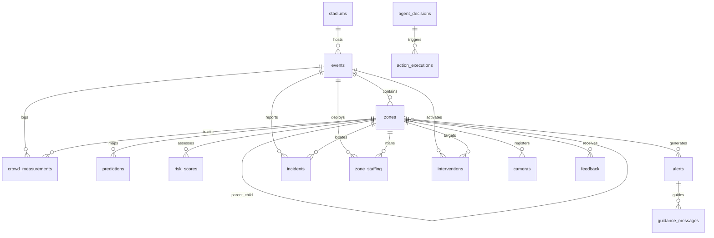

# Entity Relationship Diagram (ERD)

This document contains a visual entity relationship diagram of the database models in **FluxGuard AI v1.1**.

## Mermaid Diagram

## Description of Key Relationships

1. **Stadium & Events**: A stadium hosts multiple events. Primary configurations (such as capacity and geolocation) are defined at the stadium level.
2. **Events & Zones**: Each event instantiates a set of zones. Zones can be nested using the `parent_zone_id` relationship (for hierarchy modeling).
3. **Telemetry Ingestion (Measurements)**: Sensor telemetry (`crowd_measurements`) binds directly to the specific zone instance.
4. **Predictive Analytics (Predictions & Risk Scores)**: Predictions are associated with zones to identify potential crowding, feeding into unique real-time `risk_scores`.
5. **Directives Flow (Alerts -> Guidance)**: Crossed risk score thresholds trigger `alerts`, which compile role-scoped instructions inside `guidance_messages`.
6. **Incident Tickets**: Operational teams dispatch personnel to physical tickets registered under `incidents` mapped to events and zones.
7. **Autonomous Logic (Decisions -> Executions)**: The operations agent proposes a directive `agent_decisions` which generates concrete log actions under `action_executions` once approved.
8. **Topological Resource Allocation (Staffing & Interventions)**: Deployment rosters (`zone_staffing`) and active countermeasures (`interventions`) are traced at the event-zone boundary.
