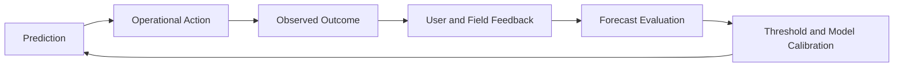

# ML Pipeline

## Simulation

MVP uses simulated crowd data to model realistic event phases:

- Pre-arrival.
- Gate surge.
- Kickoff approach.
- Halftime movement.
- Post-match exit.
- Transit bottleneck.

Simulation variables:

- Zone capacity.
- Arrival rate.
- Flow rate.
- Queue length.
- Gate throughput.
- Weather impact.
- Transit arrival bursts.
- Random incidents.

## Training

Training uses historical or simulated measurements grouped by event, zone, and time window.

Feature categories:

- Time features: minutes to kickoff, phase, day, hour.
- Zone features: type, capacity, neighboring zones.
- Flow features: density, queue length, inflow, outflow.
- External features: weather, transit arrivals, schedule changes.
- Intervention features: gate opened, volunteer deployed, route changed.

Model options:

- Prophet for interpretable MVP forecasts.
- LSTM for nonlinear temporal patterns after enough data volume exists.

## Prediction

Prediction service generates horizons:

- 20 minutes.
- 30 minutes.
- 40 minutes.

Outputs:

- Predicted density count.
- Predicted queue length.
- Predicted flow rate.
- Confidence interval.
- Model version.

## Risk Scoring

Risk score is computed from:

- Predicted density relative to capacity.
- Forecasted growth rate.
- Queue length.
- Flow degradation.
- Zone criticality.
- Neighboring zone pressure.
- Confidence level.
- Recent field feedback.

Severity bands:

- 0-39: low.
- 40-64: medium.
- 65-84: high.
- 85-100: critical.

## Feedback Loop

Feedback loop metrics:

- Forecast error by zone.
- Alert false positive rate.
- Alert false negative rate.
- Intervention response time.
- Post-action density reduction.
- User-reported clarity.

