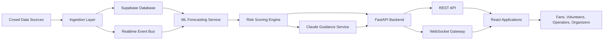
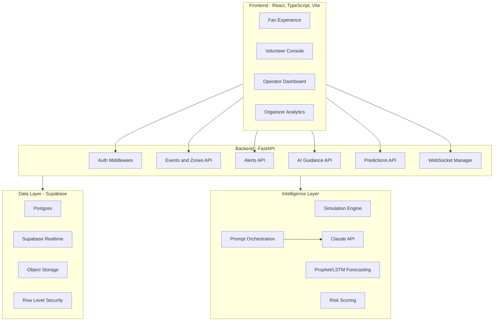
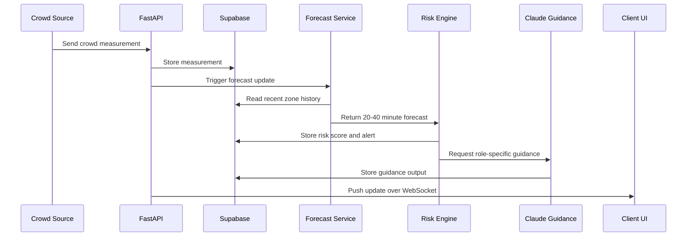
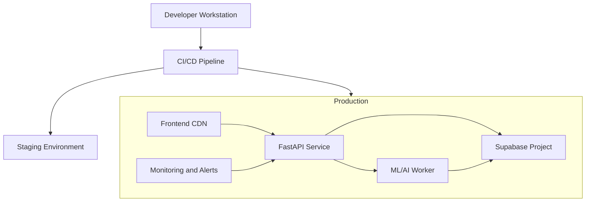

# System Architecture

## High-Level Architecture

FluxGuard AI uses a modular architecture with clear boundaries between ingestion, prediction, AI guidance, APIs, real-time delivery, and user interfaces. The design supports hackathon simulation first, while leaving a production path for live event integrations.

## Component Diagram

## Data Flow

## AI Workflow

1. Backend receives a risk event with zone, severity, forecast horizon, and context.
2. Prompt engine selects the correct role template.
3. Context is minimized to relevant facts only.
4. Claude API returns structured JSON guidance.
5. Backend validates schema, safety rules, and tone constraints.
6. Valid guidance is stored and pushed to the correct clients.
7. Invalid or unavailable AI output falls back to deterministic guidance templates.

## ML Workflow

1. Ingest or simulate time-series crowd measurements.
2. Normalize by zone capacity, time, event phase, gate assignment, weather, and transport pressure.
3. Train Prophet for interpretable baseline forecasting or LSTM for higher-volume temporal patterns.
4. Predict density, queue length, and flow rate 20, 30, and 40 minutes ahead.
5. Convert forecasts into risk scores.
6. Compare predictions to actual outcomes for continuous calibration.

## Backend Architecture

FastAPI exposes REST endpoints for configuration, dashboards, predictions, alerts, guidance, feedback, and admin operations. It also manages WebSocket channels for live zone updates and alert broadcasts.

Key backend principles:

- Separate routers by domain.
- Use service classes for business logic.
- Keep ML and AI orchestration behind interfaces.
- Validate all requests with Pydantic models.
- Enforce role-based authorization at route and data-access layers.
- Persist auditable state transitions for alerts and recommendations.

## Frontend Architecture

The frontend uses React, TypeScript, Vite, Tailwind, Framer Motion, and Recharts.

Primary surfaces:

- Fan mobile-first route guidance.
- Volunteer action console.
- Operator command dashboard.
- Organizer analytics and post-event insights.

Frontend principles:

- Component-driven architecture.
- Strict TypeScript types for API contracts.
- Accessible controls and keyboard navigation.
- State split between server state, WebSocket state, and local UI state.
- Charts for forecasts, risk trends, and zone comparisons.

## External Integrations

Potential integrations include:

- Ticket scanning systems.
- Turnstile and entry gate counters.
- CCTV or computer vision crowd density feeds.
- Wi-Fi and Bluetooth density analytics.
- Transit authority feeds.
- Weather APIs.
- Emergency notification systems.
- Stadium signage and public address systems.
- Claude API for guidance generation.

## Deployment Architecture

