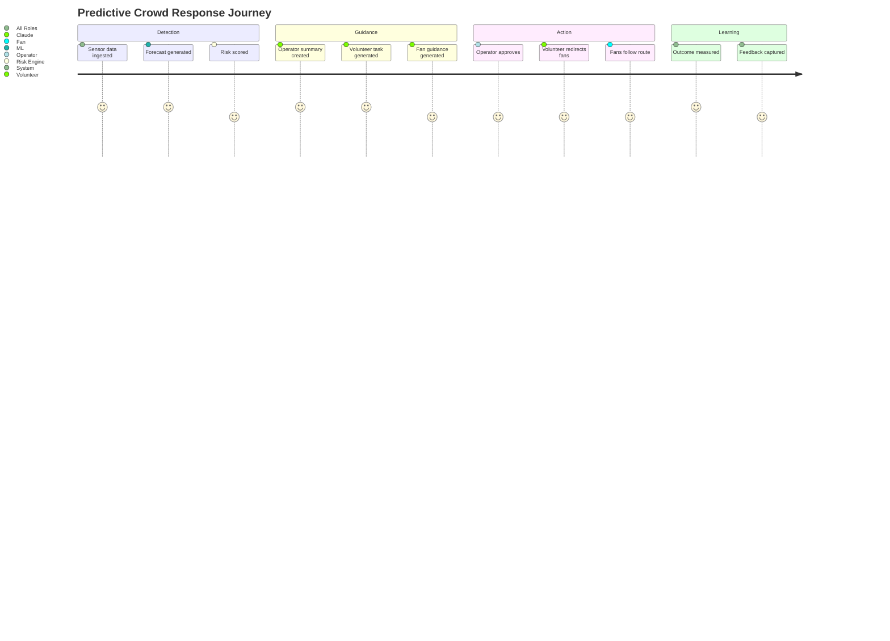

# User Journeys

## Fan Journey

1. Fan opens the event experience before arrival.
2. The platform identifies the event, ticketed gate, location consent state, and arrival phase.
3. Fan receives recommended route and expected wait time.
4. ML predicts congestion near the assigned gate in 30 minutes.
5. Claude generates fan-safe guidance: use alternate gate, walk via specific concourse, allow extra time.
6. Fan follows updated guidance.
7. Platform confirms lower-risk path and updates ETA.
8. Fan can submit feedback if route was blocked or unclear.

Success outcome: fan reaches destination with reduced wait and no exposure to high-density zones.

## Volunteer Journey

1. Volunteer signs in and sees assigned zone.
2. Dashboard shows current status, upcoming risk, and active instructions.
3. Risk score rises for nearby gate corridor.
4. Volunteer receives a concise action card.
5. Volunteer directs fans toward alternate route and marks action as started.
6. Operator sees field action status.
7. Volunteer reports local condition as improved, unchanged, or worsening.
8. Feedback updates alert state and future model calibration.

Success outcome: volunteer understands exactly what to do and operators gain field confirmation.

## Stadium Operator Journey

1. Operator opens command dashboard.
2. Dashboard loads live map, risk list, forecast chart, alerts, and AI summaries.
3. System detects a projected bottleneck at Gate B in 20-30 minutes.
4. Operator reviews drivers: inbound transit spike, slow gate throughput, nearby concession queue.
5. Operator approves recommended action plan.
6. System pushes volunteer instructions and fan route guidance.
7. Operator monitors queue trend and response status.
8. Alert is resolved, escalated, or converted into an incident record.

Success outcome: operator acts before congestion crosses safety threshold.

## Event Organizer Journey

1. Organizer reviews event-wide operational dashboard.
2. They compare forecasted and actual congestion across time windows.
3. They inspect interventions and outcomes.
4. They export post-event report with key metrics.
5. Planning team updates staffing, gate opening times, signage, and transit coordination for the next event.

Success outcome: organizer can prove impact and improve future event operations.

## Cross-Role Journey

